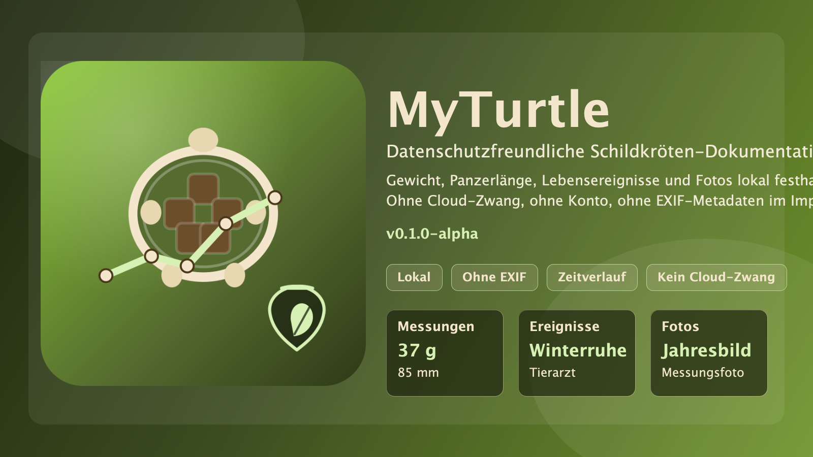

# MyTurtle

Eine kleine, lokal arbeitende Android-App zur Dokumentation des Lebens einer Schildkröte.

> Status: `v0.1.0-beta`

  <a href="https://apps.obtainium.imranr.dev/redirect?r=obtainium://app/%7B%22id%22%3A%22de.leohopper.myturtle%22%2C%22url%22%3A%22https%3A%2F%2Fgithub.com%2Fleohoppergit%2FMyTurtle%22%2C%22author%22%3A%22leohoppergit%22%2C%22name%22%3A%22MyTurtle%22%2C%22preferredApkIndex%22%3A0%2C%22additionalSettings%22%3A%22%7B%5C%22includePrereleases%5C%22%3Atrue%2C%5C%22fallbackToOlderReleases%5C%22%3Atrue%2C%5C%22filterReleaseTitlesByRegEx%5C%22%3A%5C%22%5C%22%2C%5C%22filterReleaseNotesByRegEx%5C%22%3A%5C%22%5C%22%2C%5C%22verifyLatestTag%5C%22%3Afalse%2C%5C%22sortMethodChoice%5C%22%3A%5C%22date%5C%22%2C%5C%22useLatestAssetDateAsReleaseDate%5C%22%3Afalse%2C%5C%22releaseTitleAsVersion%5C%22%3Afalse%2C%5C%22trackOnly%5C%22%3Afalse%2C%5C%22versionExtractionRegEx%5C%22%3A%5C%22%5C%22%2C%5C%22matchGroupToUse%5C%22%3A%5C%22%5C%22%2C%5C%22versionDetection%5C%22%3Atrue%2C%5C%22releaseDateAsVersion%5C%22%3Afalse%2C%5C%22useVersionCodeAsOSVersion%5C%22%3Afalse%2C%5C%22apkFilterRegEx%5C%22%3A%5C%22%5C%22%2C%5C%22invertAPKFilter%5C%22%3Afalse%2C%5C%22autoApkFilterByArch%5C%22%3Atrue%2C%5C%22appName%5C%22%3A%5C%22%5C%22%2C%5C%22appAuthor%5C%22%3A%5C%22%5C%22%2C%5C%22shizukuPretendToBeGooglePlay%5C%22%3Afalse%2C%5C%22allowInsecure%5C%22%3Afalse%2C%5C%22exemptFromBackgroundUpdates%5C%22%3Afalse%2C%5C%22skipUpdateNotifications%5C%22%3Afalse%2C%5C%22about%5C%22%3A%5C%22%5C%22%2C%5C%22refreshBeforeDownload%5C%22%3Afalse%2C%5C%22includeZips%5C%22%3Afalse%2C%5C%22zippedApkFilterRegEx%5C%22%3A%5C%22%5C%22%7D%22%2C%22overrideSource%22%3Anull%7D">
    
  </a>

  
  

## Enthalten in der Grundversion

- Mehrere Schildkröten anlegen
- Schlupfdatum, Art, Geschlecht und Notizen verwalten
- Gewichts- und Längenmessungen mit Datum eintragen
- Lebensereignisse dokumentieren
- Jahresfotos lokal per Galerie oder Kamera verknüpfen
- Mehrere Fotos pro Messung
- Einfache Verlaufsgrafik für Gewicht oder Panzerlänge
- Papierkorb mit automatischer Löschung nach 30 Tagen
- Vollständiges Backup und Wiederherstellung als ZIP-Datei
- Room-Datenbank nur auf dem Gerät, ohne Konto und ohne Cloud-Zwang
- EXIF-Daten werden beim Import aus Fotos entfernt

## Datenschutz

- Alle Daten bleiben lokal auf dem Gerät.
- Es gibt kein Konto, keine Cloud und kein Tracking.
- Android-System-Cloud-Backups sind bewusst deaktiviert; Sicherungen laufen nur über die Exportfunktion in der App.
- Fotos werden vor dem Speichern in die App ohne EXIF-Metadaten übernommen.

## Installation

### GitHub Releases

Die signierte Release-APK wird über GitHub Releases bereitgestellt.

### Obtainium

Der Obtainium-Button oben nutzt den offiziellen `/app`-Linktyp von Obtainium und übergibt bereits die vollständige App-Konfiguration.

Dadurch ist für MyTurtle auch `includePrereleases=true` direkt gesetzt, damit die aktuelle Beta-Version gefunden wird.

Falls dein Browser oder Android-Gerät keine App-Weiterleitung zulässt, kannst du alternativ direkt dieses Repository als GitHub-Quelle in Obtainium hinzufügen:

`https://github.com/leohoppergit/MyTurtle`

Wenn du den manuellen Weg nutzt, aktiviere in Obtainium bitte zusätzlich `Prereleases`, weil `v0.1.0-beta` als Pre-Release veröffentlicht ist.

### AppVerifier

Verifiziere die Signatur des Release-Zertifikats mit diesem SHA-256-Fingerprint:

`92:1B:88:ED:B4:0C:D5:95:EF:AF:BB:70:5E:1D:D2:35:D0:3D:F6:EE:FF:CF:91:5F:60:9A:66:DF:E3:35:2D:B2`

## Projektstart aus dem Quellcode

1. Ordner in Android Studio öffnen.
2. Falls `local.properties` fehlt, Android Studio den SDK-Pfad setzen lassen.
3. Gradle-Sync starten.
4. App auf Emulator oder Gerät ausführen.

## Backup & Wiederherstellung

- In den Einstellungen kannst du vollständige ZIP-Backups exportieren und später wiederherstellen.
- Gesichert werden Schildkröten, Messungen, Lebensereignisse, Fotos und die gewählte Startscreen-Kartenansicht.
- Automatische Android-System- oder Cloud-Backups sind bewusst deaktiviert, damit die Daten nicht ungefragt außerhalb des Geräts landen.

## Hinweise zum Beta-Status

- Fotos werden als lokale `file://`-URIs im App-Speicher gehalten.
- Die App nutzt den System-Dokumentenpicker, damit keine breit gefassten Medienspeicherrechte nötig sind.
- Das Room-Schema wird exportiert und es gibt keine destruktive automatische Migration mehr.
- Release-Builds sind minifiziert und ressourcengeschrumpft.
- Gradle prüft Build-Artefakte per SHA-256; reine IDE-Quell-/Javadoc-Artefakte werden bewusst ausgenommen.
- Vor einer öffentlichen `1.0` sollte der Restore-Pfad zusätzlich noch einmal praktisch auf mehreren Geräten gegengeprüft werden.

## Brand-Assets

Die öffentlichen Brand-Assets für README, Release-Seite und spätere Store-/Repo-Grafiken liegen unter [docs/assets](docs/assets).
